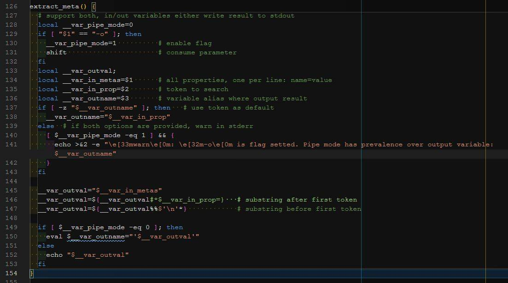

---

<!--

-->


**Las funciones Bash**, a diferencia de en la mayoría de los lenguajes de programación, **no permiten como tal retornar valores hacia el flujo desde dónde se llamó**. Cuando la ejecución de una función bash finaliza, su valor de retorno es su estado: cero como éxito, y distinto si ha terminado mal. Para abordar la devolución de valores, se puede establecer una **variable global** con el resultado, usar la **sustitución de comandos**, o incluso puede **pasar el nombre de una variable** para usarla como variable de resultado. Los ejemplos siguientes describen estos diferentes mecanismos.
<!--more-->

Aunque bash tiene una declaración `return`, lo único que puede especificar con ella es el estado de la función, que es un valor numérico, entre 0 y 255, como el valor especificado en una declaración `exit`. El valor de estado se almacena en la variable `$?`. Si una función no contiene una declaración `return`, su estado se establece en función del estado de la última declaración ejecutada en la función. Es por ello que para devolver valores arbitrarios, se deben utilizar otros mecanismos.

La forma más sencilla de devolver un valor de una función bash es simplemente **establecer una variable global** para el resultado. Dado que todas las variables en bash son globales por defecto, esto es fácil:

```bash
# declare
function awesome_func() {
    # set global variable value
    my_result='some value'
}

# call / invoke
awesome_func
echo $my_result
```

El código anterior establece en la variable global `my_result` el resultado de la función. Razonablemente simple, pero como todos sabemos, el uso de variables globales, particularmente en programas grandes, puede generar errores difíciles de encontrar.

Un mejor enfoque es **usar variables locales** en sus funciones. Entonces, el problema se convierte en cómo hacer llegar el resultado desde la parte de código dónde se llamó. Se puede **utilizar la sustitución de comandos**, también denominados *sub-shells*:

```shell
function awesome_func() {
    # do some work
    local my_result;
    my_result='some value'
    # print to standard output
    echo "$my_result"
}

# call /invoke in a subshell
result=$(awesome_func)
# or using the legacy way (with backticks)...
#result=`awesome_func`
echo $?          # numeric function exit code. `echo "$my_result"`
echo $result
echo $my_result  # <-- empty/undefined
                 # due to it's local scoped to `awesome_func`
```

Aquí, el resultado se envía a la salida estándar y en el flujo desde dónde se llama usa la sustitución de comandos para capturar el valor en una variable. A continuación, la variable se puede utilizar según sea necesario. Solamente un pero, y es por cuestiones de rendimiento: el coste que conlleva abrir un subproceso de la terminal.

La otra forma de devolver un valor es **codificar la función para que acepte un nombre de variable** como parte de su línea de comando **y luego establecer esa variable en el resultado** de la función:

```shell
function awesome_func() {
    # save output variable name parameter
    local __var_outval=$1
    # do some work
    local my_result;
    my_result='some value'
    # assign result to output variable
    eval $__var_outval="'$my_result'"
}

# call with variable name argument
awesome_func result
echo $?          # numeric function exit code. `eval...`.
# here `result` variable contains assigned value
echo $result
```

Dado que tenemos el nombre de la variable a configurar almacenado en una variable, no podemos configurar la variable directamente, tenemos que usar `eval` para realizar la asignación. La declaración `eval` básicamente le dice a bash que interprete la línea dos veces, la primera interpretación anterior da como resultado la cadena `my_result = 'some value'` que luego se interpreta una vez más y termina configurando la variable que se pasó como parámetro.

Cuando almacene el nombre de la variable pasada en la línea de comando, **asegúrese de hacerlo en una variable local con un nombre** que no se use, o sea poco probable, desde dónde se llama (de ahí `__var_outval` en lugar de solo `var_outval`). Si se da la casualidad que los nombres coinciden, variable local como parámetro de entrada, la variable de resultado no se establecerá. Por ejemplo, lo siguiente no funciona:

```shell
function awesome_func() {
    local result=$1             # caller variable name collision
    local my_result;
    my_result='some value'
    eval $result="'$my_result'" # variable assign collision
}

awesome_func result
echo $result
```

La razón por la que no funciona es porque cuando `eval` hace la segunda interpretación y evalúa `result='some value'`, el resultado ahora es una variable local en la función, se preserva el alcance, y se asigna en ella en lugar de hacerlo sobre aquella variable superior a la que apunta el nombre que pasamos por parámetro.

**Si desea una mayor flexibilidad**, es posible codificar sus funciones para **combinar lo mejor de ambos mundos**, tanto las variables de resultado como la sustitución de comandos:

```shell
function awesome_func() {
    # save output variable name parameter
    local __var_outval=$1
    # do some work
    local my_result;
    my_result='some value'
    # decide how to output computed value
    if [ -n "$__var_outval" ]; then         # if name provided...
        eval $__var_outval="'$my_result'"   # ... assign
    else                     # if not...
        echo "$my_result"    # ... print to standard output
    fi
}

awesome_func result
echo $?          # numeric function exit code. `eval...`.
echo $result
result2=$(awesome_func)
echo $?          # numeric function exit code. `echo...`.
echo $result2
```

Como se puede ver arriba, si no si no se pasa nombre de variable a la función, `[[ "$__var_outval" ]]` evalua a `false` y por tanto el resultado se escribe en la salida estándar.

## Un caso de la vida real

Y aquí una función con un poco más de chicha, vivo retrato de la imagen que se puede ver como cabecera del artículo. :rocket:

Todos estos conceptos se ponen en práctica, pero delegando el uso de salida estándar a si se establece o no una determinada bandera como opción de entrada:

```shell
function extract_meta() {
  # support both, in/out variables either write result to stdout
  local __var_pipe_mode=0
  if [ "$1" = "-o" ]; then
    __var_pipe_mode=1          # enable flag
    shift                      # consume parameter
  fi
  local __var_outval;
  local __var_in_metas=$1      # all properties, one per line: name=value
  local __var_in_prop=$2       # token to search
  local __var_outname=$3       # variable alias where output result
  if [ -z "$__var_outname" ]; then   # use token as default
    __var_outname="$__var_in_prop"
  else  # if both options are provided, warn in stderr
    [ $__var_pipe_mode -eq 1 ] && {
      printf >&2 "\e[33mwarn\e[0m: \e[32m-o\e[0m is flag set. Pipe mode has prevalence over output variable: %s" "$__var_outname"
    }
  fi

  __var_outval="$__var_in_metas"
  __var_outval=${__var_outval#*$__var_in_prop=}   # substring after first token
  __var_outval=${__var_outval%%$'\n'*}            # substring before first token

  if [ $__var_pipe_mode -eq 0 ]; then
    eval $__var_outname="'$__var_outval'"
  else
    printf "$__var_outval"
  fi
}
```

Y aquí más abajo el código para probar la función y cual es el resultado de ejecutar en cada caso :wink::

```shell
# Giving ...
metas="
  exitcode=%{exitcode}
  errormsg=%{errormsg}
  http_code=%{http_code}
  num_redirects=%{num_redirects}
  redirect_url=%{redirect_url}
  url_effective=%{url_effective}
"

# Do ...
extract_meta "$metas" exitcode
echo "$exitcode"      # %{exitcode}

extract_meta "$metas" errormsg myerror
echo "$errormsg"      # <-- empty/undefined
                      # due to variable name is the 3th argument: `myerror`
echo "$myerror"       # %{errormsg}

http_code=$(extract_meta -o "$metas" http_code)
echo $?               # numeric function exit code. `echo "$my_result"`
echo "$http_code"     # %{http_code}
```

¡¡A automatizar!! Se ha dicho... :smile:

*Passion = Learn + Code + Enjoy + Repeat* :hugs:
